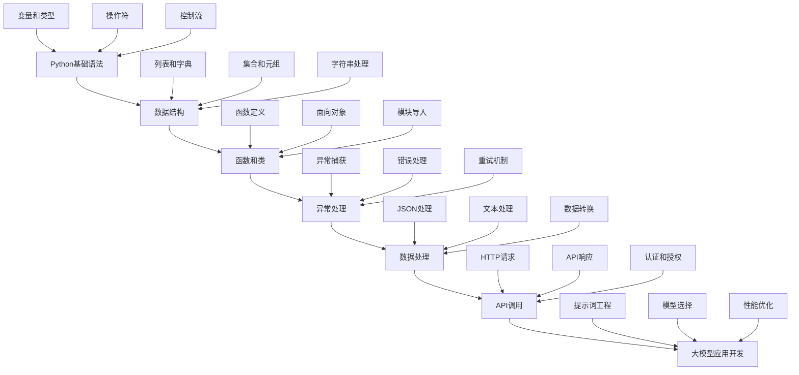

# Python 3 基础学习教程 - 面向大模型技术初学者

> **教程说明**：本教程专为大模型（LLM）技术初学者设计，涵盖Python编程的核心概念，并结合大模型开发中的实际应用场景。

## 📚 教程特色

- **面向大模型开发**：所有示例都结合大模型技术实际应用场景
- **循序渐进**：从基础语法到高级概念，适合零基础学习者
- **实用性强**：提供大量实际项目中的代码示例
- **中文注释**：所有代码都有详细的中文注释和说明
- **互动式学习**：基于Jupyter Notebook，支持实时运行和修改

## 🎯 学习目标

通过本教程，您将掌握：

1. **Python基础语法**：变量、数据类型、操作符、控制流
2. **数据结构**：列表、字典、集合、元组的应用
3. **函数和类**：面向对象编程在大模型开发中的应用
4. **异常处理**：API调用中的错误处理和重试机制
5. **数据处理**：JSON解析、文本处理、数据转换
6. **实际应用**：构建大模型应用的核心技能

## 📖 教程内容

### 第一章：Python基础
- [x] 对象、基本类型和变量
- [x] 基本操作符和优先级
- [x] 基本容器类型（列表、字典、集合、元组）
- [x] 访问容器中的数据

### 第二章：函数和对象
- [x] 内置函数和可调用对象
- [x] 对象属性和方法
- [x] 字符串、列表、集合、字典的方法
- [x] 位置参数和关键字参数

### 第三章：高级特性
- [x] 字符串格式化和占位符
- [x] for循环和while循环
- [x] if语句和条件判断
- [x] 列表、集合和字典推导式

### 第四章：面向对象编程
- [x] 类型构造函数
- [x] 模块导入
- [x] 异常处理
- [x] 类和对象创建

### 第五章：大模型开发实战
- [x] API调用和响应处理
- [x] 提示词工程
- [x] 数据处理和转换
- [x] 错误处理和重试机制
- [x] 性能优化

## 🚀 快速开始

### 环境要求
- Python 3.7+
- Jupyter Notebook 或 JupyterLab
- 推荐使用虚拟环境

### 安装步骤

1. **克隆或下载教程**
```bash
git clone <repository-url>
cd chapter01-llm-env/python-base
```

2. **创建虚拟环境**
```bash
python -m venv llm-env
source llm-env/bin/activate  # Linux/Mac
# 或
llm-env\Scripts\activate  # Windows
```

3. **安装依赖**
```bash
pip install jupyter notebook
```

4. **启动Jupyter Notebook**
```bash
jupyter notebook learning-python3.ipynb
```

### 在线运行
- 点击 [在线运行](https://mybinder.org/v2/gist/kenjyco/69eeb503125035f21a9d/HEAD?filepath=learning-python3.ipynb) 通过 mybinder.org 在浏览器中加载此笔记本

## 💡 学习建议

### 对于初学者
1. **按顺序学习**：从第一章开始，逐步学习每个概念
2. **动手实践**：运行每个代码示例，尝试修改参数
3. **理解应用场景**：重点关注大模型开发中的实际应用
4. **多做练习**：完成每章后的练习题

### 对于有经验的开发者
1. **快速浏览**：重点关注大模型相关的应用示例
2. **实践项目**：尝试将学到的概念应用到实际项目中
3. **深入理解**：研究代码的性能优化和最佳实践

## 🔧 大模型开发工具链

### 核心库
- **OpenAI API**：GPT系列模型调用
- **LangChain**：大模型应用开发框架
- **Transformers**：Hugging Face预训练模型库
- **Pandas**：数据处理和分析
- **NumPy**：数值计算

### 开发环境
- **Jupyter Notebook**：交互式开发
- **VS Code**：代码编辑和调试
- **Docker**：容器化部署
- **Git**：版本控制

## 📊 学习路径



## 🎯 实际应用场景

### 1. 聊天机器人开发
- 使用字符串处理和格式化构建提示词
- 通过字典管理对话状态和历史
- 利用异常处理确保系统稳定性

### 2. 文本分析和处理
- 使用列表推导式批量处理文本
- 通过集合操作进行去重和特征提取
- 利用正则表达式进行模式匹配

### 3. API集成和调用
- 使用requests库调用大模型API
- 通过JSON处理API响应数据
- 利用重试机制处理网络异常

### 4. 数据处理和转换
- 使用Pandas处理结构化数据
- 通过NumPy进行数值计算
- 利用类型转换确保数据一致性

## 📈 进阶学习

完成本教程后，建议继续学习：

1. **高级Python特性**
   - 装饰器和生成器
   - 异步编程（async/await）
   - 元编程和反射

2. **大模型开发框架**
   - LangChain深度应用
   - FastAPI构建API服务
   - Streamlit创建用户界面

3. **机器学习和深度学习**
   - PyTorch/TensorFlow基础
   - 模型训练和推理
   - 向量数据库和RAG系统

4. **系统设计和部署**
   - 微服务架构
   - Docker容器化
   - Kubernetes编排

## 🤝 贡献和反馈

欢迎提交问题、建议和改进：

- **问题报告**：在Issues中描述遇到的问题
- **功能建议**：提出教程改进建议
- **代码贡献**：提交代码改进和示例
- **文档完善**：帮助完善教程文档

## 📄 许可证

本教程采用 MIT 许可证，详见 [LICENSE](LICENSE) 文件。

## 🙏 致谢

感谢所有为大模型技术发展做出贡献的开发者和研究者，以及为Python教育提供资源的社区。

---

**开始您的Python和大模型开发之旅吧！** 🚀

如有任何问题，请随时联系或查看相关文档。
