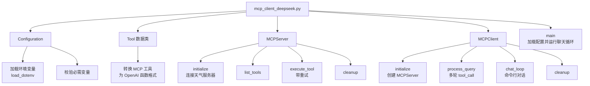
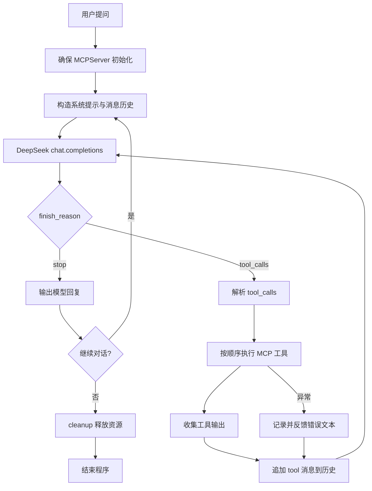

# mcp_client_deepseek.py 拆解

## 定位与职责
- 面向旅行天气顾问场景的对话式 MCP 客户端，结合 DeepSeek 模型自动选择并串联天气工具。
- 展示 “模型自动编排 + MCP 工具执行” 的完整闭环。

## 代码结构

- 环境配置：`Configuration`（`02-agent-llm-mcp/mcp-demo/client/mcp_client_deepseek.py:28`）
- 工具抽象：`Tool` → OpenAI 函数格式（`02-agent-llm-mcp/mcp-demo/client/mcp_client_deepseek.py:65`）
- 服务器管理：`MCPServer`（`02-agent-llm-mcp/mcp-demo/client/mcp_client_deepseek.py:107`）
- 业务核心：`MCPClient`（`02-agent-llm-mcp/mcp-demo/client/mcp_client_deepseek.py:213`）

## 业务流程

1. 读取配置，连接天气 MCP 服务器。
2. 构造系统提示，指导模型在旅行场景中何时调用预警/预报工具。
3. DeepSeek 决定是否发起工具调用，客户端执行并收集结果。
4. 将工具输出反馈给模型，直到得到最终回复或达到回合上限。
5. 支持多轮对话，`quit/exit` 结束时清理资源。

## 关键方法解析
- `process_query`：实现 ReAct 式“思考-行动-观察”，设定最大工具回合数防止死循环。
- 系统提示模板：明确调用条件、工具顺序及结果整合策略（`02-agent-llm-mcp/mcp-demo/client/mcp_client_deepseek.py:254`）。
- `execute_tool`：封装重试与日志，确保单个工具失败不会立即终止对话。
- 工具结果整合：解析 `TextContent`，按 `tool_call_id` 返回给模型。
- `chat_loop`：命令行交互入口，模拟真实用户问答。

## 与 PPT 大纲的关联
- “MCP 实战进阶：集成DeepSeek模型，升级旅行天气顾问”（第10页）。
- “旅行 Agent 视角：综合案例演示”的核心代码（第11页）。
- 作业拓展与下一阶段多工具协作的基础（第12页）。
