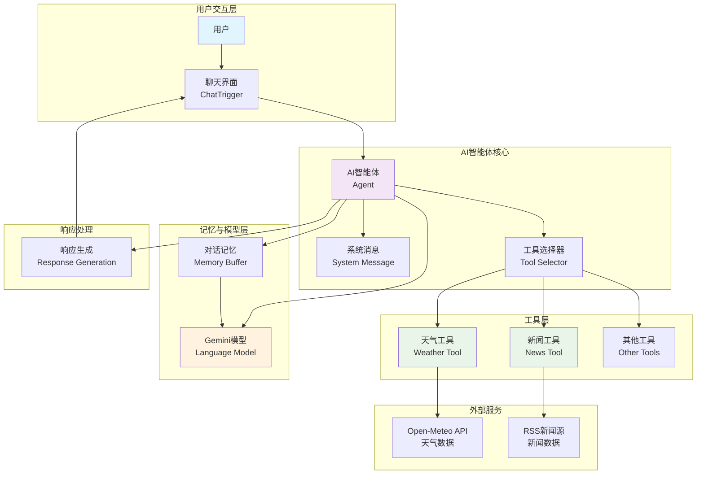
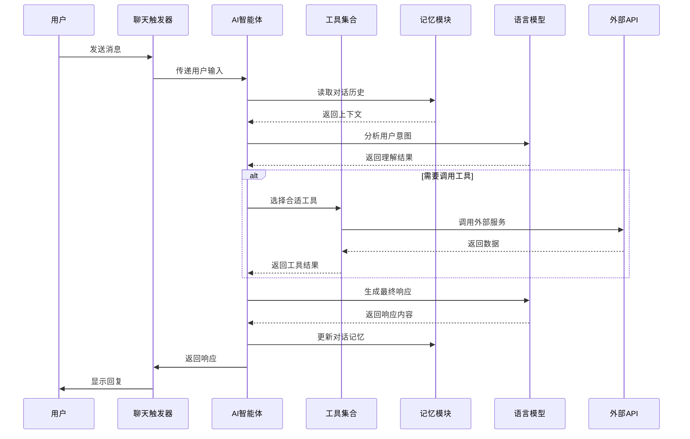
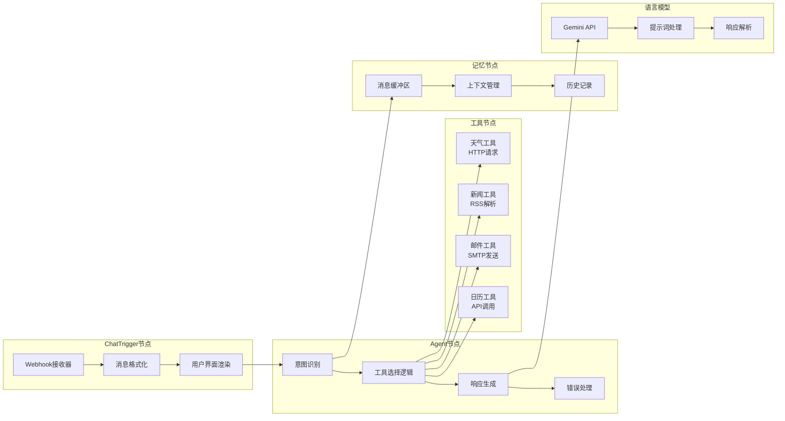
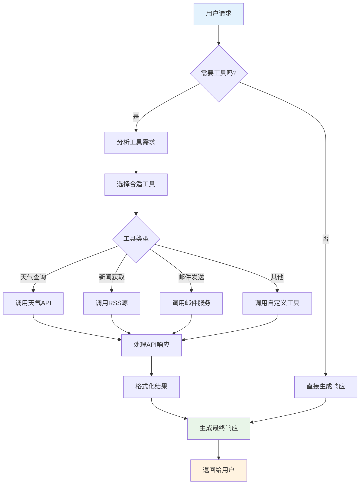
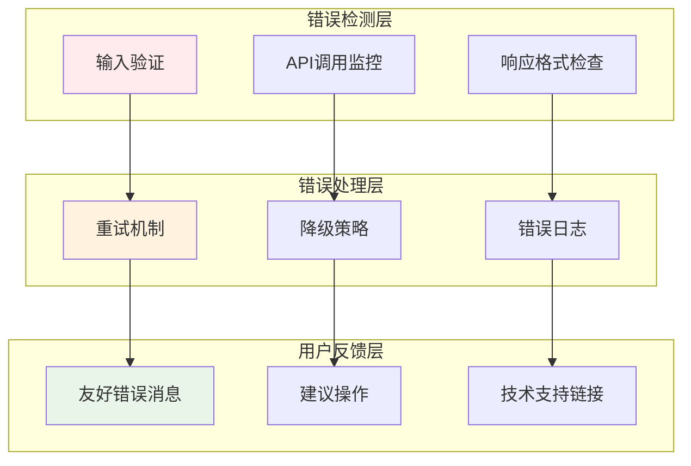
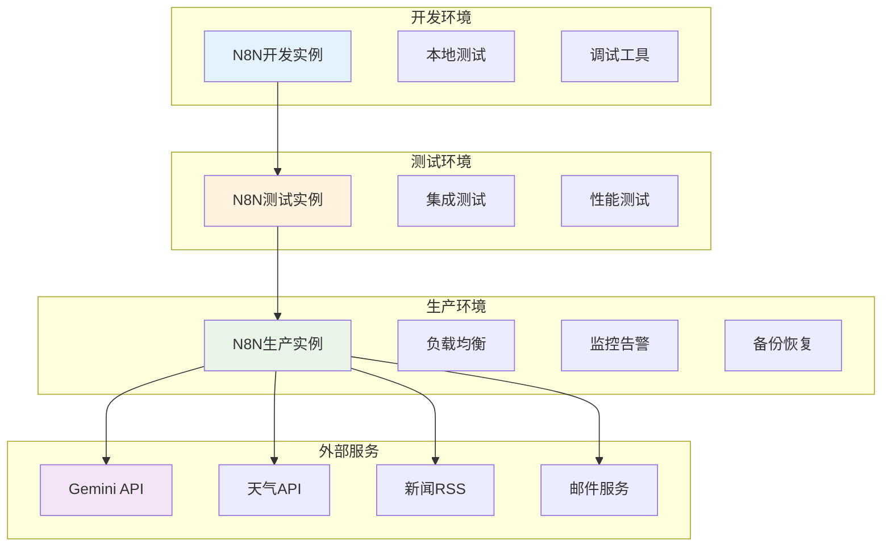
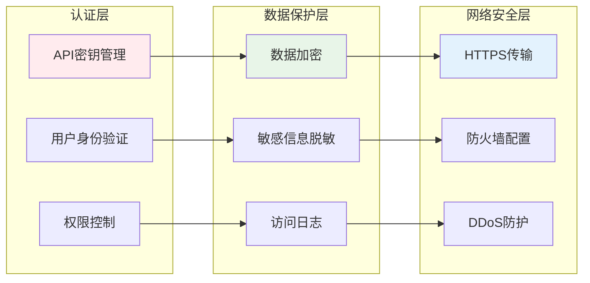
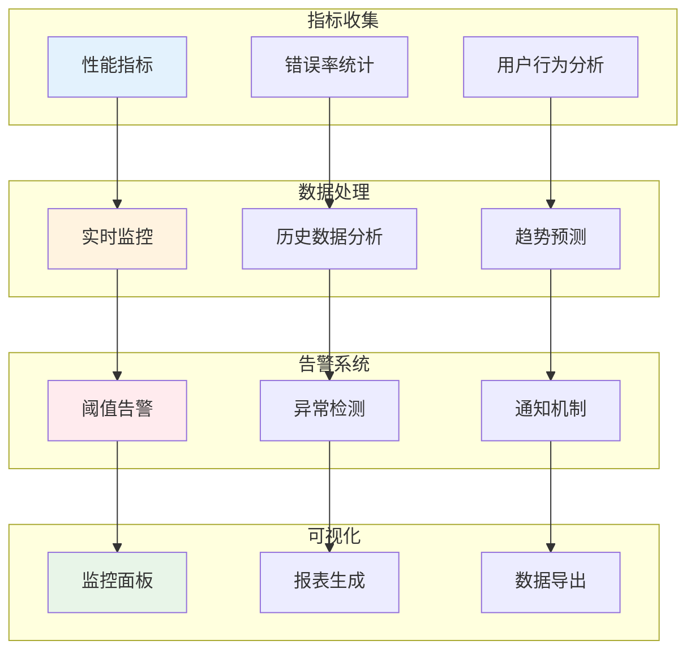

# N8N AI智能体架构图

## 系统架构概览

```mermaid
graph TB
    subgraph "用户交互层"
        A[用户] --> B[聊天界面<br/>ChatTrigger]
    end
    
    subgraph "AI智能体核心"
        B --> C[AI智能体<br/>Agent]
        C --> D[系统消息<br/>System Message]
        C --> E[工具选择器<br/>Tool Selector]
    end
    
    subgraph "工具层"
        E --> F[天气工具<br/>Weather Tool]
        E --> G[新闻工具<br/>News Tool]
        E --> H[其他工具<br/>Other Tools]
    end
    
    subgraph "外部服务"
        F --> I[Open-Meteo API<br/>天气数据]
        G --> J[RSS新闻源<br/>新闻数据]
    end
    
    subgraph "记忆与模型层"
        C --> K[对话记忆<br/>Memory Buffer]
        C --> L[Gemini模型<br/>Language Model]
        K --> L
    end
    
    subgraph "响应处理"
        C --> M[响应生成<br/>Response Generation]
        M --> B
    end
    
    style A fill:#e1f5fe
    style C fill:#f3e5f5
    style F fill:#e8f5e8
    style G fill:#e8f5e8
    style L fill:#fff3e0
```

## 数据流图

```mermaid
sequenceDiagram
    participant U as 用户
    participant CT as 聊天触发器
    participant A as AI智能体
    participant T as 工具集合
    participant M as 记忆模块
    participant LM as 语言模型
    participant API as 外部API
    
    U->>CT: 发送消息
    CT->>A: 传递用户输入
    A->>M: 读取对话历史
    M-->>A: 返回上下文
    A->>LM: 分析用户意图
    LM-->>A: 返回理解结果
    
    alt 需要调用工具
        A->>T: 选择合适工具
        T->>API: 调用外部服务
        API-->>T: 返回数据
        T-->>A: 返回工具结果
    end
    
    A->>LM: 生成最终响应
    LM-->>A: 返回响应内容
    A->>M: 更新对话记忆
    A->>CT: 返回响应
    CT->>U: 显示回复
```

## 组件详细架构

```mermaid
graph LR
    subgraph "ChatTrigger节点"
        A1[Webhook接收器]
        A2[消息格式化]
        A3[用户界面渲染]
    end
    
    subgraph "Agent节点"
        B1[意图识别]
        B2[工具选择逻辑]
        B3[响应生成]
        B4[错误处理]
    end
    
    subgraph "工具节点"
        C1[天气工具<br/>HTTP请求]
        C2[新闻工具<br/>RSS解析]
        C3[邮件工具<br/>SMTP发送]
        C4[日历工具<br/>API调用]
    end
    
    subgraph "记忆节点"
        D1[消息缓冲区]
        D2[上下文管理]
        D3[历史记录]
    end
    
    subgraph "语言模型"
        E1[Gemini API]
        E2[提示词处理]
        E3[响应解析]
    end
    
    A1 --> A2 --> A3
    A3 --> B1
    B1 --> B2 --> B3 --> B4
    B2 --> C1
    B2 --> C2
    B2 --> C3
    B2 --> C4
    B1 --> D1 --> D2 --> D3
    B3 --> E1 --> E2 --> E3
```

## 工具调用流程

```mermaid
flowchart TD
    A[用户请求] --> B{需要工具吗?}
    B -->|是| C[分析工具需求]
    B -->|否| D[直接生成响应]
    
    C --> E[选择合适工具]
    E --> F{工具类型}
    
    F -->|天气查询| G[调用天气API]
    F -->|新闻获取| H[调用RSS源]
    F -->|邮件发送| I[调用邮件服务]
    F -->|其他| J[调用自定义工具]
    
    G --> K[处理API响应]
    H --> K
    I --> K
    J --> K
    
    K --> L[格式化结果]
    L --> M[生成最终响应]
    D --> M
    M --> N[返回给用户]
    
    style A fill:#e3f2fd
    style M fill:#e8f5e8
    style N fill:#fff3e0
```

## 错误处理架构

```mermaid
graph TB
    subgraph "错误检测层"
        A[输入验证]
        B[API调用监控]
        C[响应格式检查]
    end
    
    subgraph "错误处理层"
        D[重试机制]
        E[降级策略]
        F[错误日志]
    end
    
    subgraph "用户反馈层"
        G[友好错误消息]
        H[建议操作]
        I[技术支持链接]
    end
    
    A --> D
    B --> E
    C --> F
    D --> G
    E --> H
    F --> I
    
    style A fill:#ffebee
    style D fill:#fff3e0
    style G fill:#e8f5e8
```

## 部署架构

```mermaid
graph TB
    subgraph "开发环境"
        A1[N8N开发实例]
        A2[本地测试]
        A3[调试工具]
    end
    
    subgraph "测试环境"
        B1[N8N测试实例]
        B2[集成测试]
        B3[性能测试]
    end
    
    subgraph "生产环境"
        C1[N8N生产实例]
        C2[负载均衡]
        C3[监控告警]
        C4[备份恢复]
    end
    
    subgraph "外部服务"
        D1[Gemini API]
        D2[天气API]
        D3[新闻RSS]
        D4[邮件服务]
    end
    
    A1 --> B1
    B1 --> C1
    C1 --> D1
    C1 --> D2
    C1 --> D3
    C1 --> D4
    
    style A1 fill:#e3f2fd
    style B1 fill:#fff3e0
    style C1 fill:#e8f5e8
    style D1 fill:#f3e5f5
```

## 安全架构

```mermaid
graph LR
    subgraph "认证层"
        A[API密钥管理]
        B[用户身份验证]
        C[权限控制]
    end
    
    subgraph "数据保护层"
        D[数据加密]
        E[敏感信息脱敏]
        F[访问日志]
    end
    
    subgraph "网络安全层"
        G[HTTPS传输]
        H[防火墙配置]
        I[DDoS防护]
    end
    
    A --> D
    B --> E
    C --> F
    D --> G
    E --> H
    F --> I
    
    style A fill:#ffebee
    style D fill:#e8f5e8
    style G fill:#e3f2fd
```

## 监控架构

```mermaid
graph TB
    subgraph "指标收集"
        A[性能指标]
        B[错误率统计]
        C[用户行为分析]
    end
    
    subgraph "数据处理"
        D[实时监控]
        E[历史数据分析]
        F[趋势预测]
    end
    
    subgraph "告警系统"
        G[阈值告警]
        H[异常检测]
        I[通知机制]
    end
    
    subgraph "可视化"
        J[监控面板]
        K[报表生成]
        L[数据导出]
    end
    
    A --> D
    B --> E
    C --> F
    D --> G
    E --> H
    F --> I
    G --> J
    H --> K
    I --> L
    
    style A fill:#e3f2fd
    style D fill:#fff3e0
    style G fill:#ffebee
    style J fill:#e8f5e8
```
