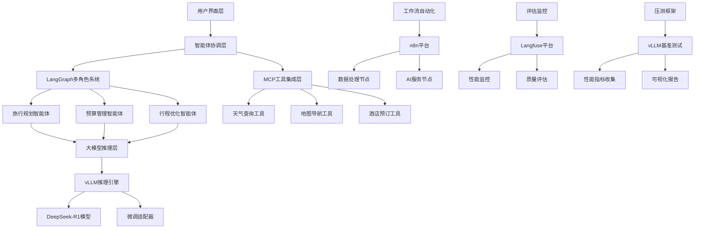

# 从0到1打造多角色AI Agent - 完整学习指南

<div align="center">


**企业级AI旅行规划智能体 · 从理论到实战的全链路开发技能**

[快速开始](#-快速开始) • [课程内容](#-课程内容) • [技术栈](#-技术栈) • [实战项目](#-实战项目) • [环境搭建](#-环境搭建)

</div>

---

## 📚 课程简介

### 🎯 课程目标

本课程聚焦"从零到一"构建企业级AI旅行规划智能体，旨在帮助学员掌握从理论到实战的全链路开发技能。通过实战驱动的学习路径，学员将能够独立开发可商用的AI旅行规划解决方案，并获得在AI应用开发领域的就业竞争力。

### 👥 适合人群

| 人群类型 | 适用场景 | 收获价值 |
|---------|----------|----------|
| **AI开发初学者** | 计算机专业学生或对AI感兴趣的开发者 | 系统学习大模型应用开发 |
| **旅游科技团队** | 需要快速掌握AI旅行规划技术的开发团队 | 实用的技术解决方案 |
| **转型工程师** | 从传统软件开发转向AI+旅游方向 | 新技术栈的掌握和应用 |
| **创业者/产品经理** | 进行产品规划和商业模式探索 | 技术实现的深度理解 |

### 🎨 课程特色

- **📈 通用框架**：核心架构可应用于医疗、金融、科研等不同行业
- **🎯 实战导向**：以完整的AI旅行规划项目为核心案例
- **🔧 技术前沿**：涵盖MCP、n8n、vLLM、多智能体协作等最新技术
- **💼 企业级解决方案**：满足真实业务需求，注重性能优化和成本控制
- **🎓 职业发展**：包含面试技巧和职业规划指导

---

## 📖 课程内容

### 🏆 课程收获

| 收获类别 | 具体内容 |
|----------|----------|
| **🛠️ 完整技术栈** | 掌握从环境搭建到企业级部署的完整AI旅行规划技术链路 |
| **💼 实战项目** | 获得可直接应用于旅游业务场景的实战项目经验 |
| **🔬 前沿技术** | 深入理解MCP、n8n、vLLM、多智能体协作、大模型微调等最新技术 |
| **🏭 企业级能力** | 学习如何降低推理成本/微调垂直模型/压测和评估等，提升系统性能和稳定性 |
| **💡 职业发展** | 获得AI应用开发领域的面试技巧和职业发展指导 |

### 📋 课程大纲

#### 📁 00. 环境准备阶段
```
📂 00-agent-env/
├── 🐧 Linux运维基础 - Ubuntu 22.04配置手册
├── 🐍 Python基础环境 - Python 3.10.18开发环境
├── 📓 Jupyter Lab配置 - 交互式开发环境
├── 🎯 Cursor开发工具 - AI辅助编程环境
├── 🐳 Docker容器化 - Milvus向量数据库部署
└── ☁️ Google Colab - 云端开发环境配置
```

#### 🧠 01. 提示词与上下文工程
```
📂 01-agent-prompt-or-context/
├── 📝 提示词工程基础
│   ├── 基础提示词结构设计
│   ├── 角色扮演与少样本学习
│   ├── 思维链推理与工具使用
│   └── 避免幻觉的最佳实践
├── 🔄 上下文工程进阶
│   ├── 上下文管理策略
│   ├── 记忆机制设计
│   ├── 信息压缩与检索
│   └── 多轮对话上下文保持
└── 💡 最佳实践案例
    ├── 提示词优化技巧
    ├── 图表与视频案例分析
    └── 逻辑思维训练
```

#### 🚀 02. 大模型推理部署
```
📂 02-agent-model-deploy/
├── 🤖 Transformers基础
│   ├── 模型加载与使用
│   ├── Tokenizer处理
│   └── 快速入门教程
├── ⚡ vLLM高性能推理
│   ├── 部署配置优化
│   ├── 推理性能调优
│   ├── 批处理与并发
│   └── 内存管理策略
└── 📊 推理性能评估
    ├── 核心概念与挑战
    ├── 优化方案对比
    └── 生产环境部署
```

#### 🔗 03. MCP协议集成
```
📂 03-agent-llm-mcp/
├── 📖 MCP协议原理
│   ├── 协议架构设计
│   ├── 通信模式详解
│   └── 安全机制分析
├── 🛠️ 实战Demo开发
│   ├── 天气服务器实现
│   ├── 客户端开发
│   ├── 调试工具使用
│   └── DeepSeek模型集成
└── 🎯 实际应用场景
    ├── 工具调用实现
    ├── 多轮对话支持
    └── LangChain集成
```

#### 👥 04. 多角色智能体系统
```
📂 04-agent-multi-role/
├── 🔗 LangChain基础
│   ├── 核心概念理解
│   ├── 链式调用设计
│   └── 工具集成方案
├── 🕸️ LangGraph状态管理
│   ├── 图结构设计
│   ├── 状态机管理
│   ├── 并行执行模式
│   ├── 人机交互循环
│   ├── 长期记忆管理
│   └── 生产环境部署
└── 🏨 旅行智能体实现
    ├── 多角色协作机制
    ├── 决策流程设计
    └── 个性化推荐算法
```

#### 🔧 05. 模型微调与优化
```
📂 05-agent-model-finetuning/
├── 🦙 LlamaFactory微调框架
│   ├── 微调策略选择
│   ├── 数据预处理流程
│   ├── 训练监控与调优
│   └── 模型评估方法
├── 📊 PEFT参数高效微调
│   ├── LoRA技术原理
│   ├── 适配器设计
│   └── 性能对比分析
└── 🏥 医疗领域应用案例
    ├── 眼科诊断助手
    ├── 数据集构建方法
    └── Easy Dataset工具使用
```

#### 📈 06. 智能体评估体系
```
📂 06-agent-evaluation/
├── 📊 Langfuse评估平台
│   ├── 性能监控指标
│   ├── 对话质量评估
│   ├── 成本效益分析
│   └── A/B测试框架
└── 🔒 安全性评估
    ├── 提示词注入检测
    ├── 输出内容过滤
    └── 隐私保护机制
```

#### 🏃 07. 性能压测框架
```
📂 07-agent-llm_benchmark/
├── 🚀 vLLM压测工具
│   ├── 吞吐量测试
│   ├── 延迟性能分析
│   ├── 并发能力评估
│   └── 资源使用监控
├── 📊 性能指标分析
│   ├── TTFT首Token时间
│   ├── TPOT每Token时间
│   ├── ITL Token间延迟
│   └── 端到端延迟评估
└── 📈 可视化报告
    ├── 性能图表生成
    ├── 趋势分析报告
    └── 优化建议输出
```

#### 🔄 08. 工作流自动化
```
📂 08-agent-workflow-n8n/
├── 🔧 n8n平台介绍
│   ├── 可视化工作流设计
│   ├── 节点生态系统
│   └── 社区资源利用
├── 🤖 AI工作流构建
│   ├── 多模态数据处理
│   ├── 自动化任务调度
│   └── 第三方系统集成
└── 📋 模板与最佳实践
    ├── 常用工作流模板
    ├── 性能优化技巧
    └── 故障排查方法
```

#### 📝 09. 项目总结与复盘(分享面试考点和经验)
```
📂 09-agent-review/
├── 💡 技术要点回顾
├── 🎯 项目成果展示
└── 📚 持续学习建议
```

---

## 🛠️ 技术栈

### 🏗️ 系统架构图



### 🔧 核心技术组件

| 技术领域 | 核心技术 | 版本 | 应用场景 |
|---------|----------|------|----------|
| **🧠 大语言模型** | GPT/DeepSeek-R1 | 4o/32B | 核心推理引擎 |
| **⚡ 推理框架** | vLLM | 0.8.5+ | 高性能推理服务 |
| **🔗 智能体框架** | LangChain + LangGraph | 0.3.x  | 多角色协作系统 |
| **🌐 模型上下文协议** | MCP (Model Context Protocol) | 1.5.0 | 工具集成协议 |
| **🎯 微调框架** | LlamaFactory | 0.9.2 | 模型个性化微调 |
| **📊 评估平台** | Langfuse | 3.3.0 | 性能监控与评估 |
| **📋 模型压测** | vLLM Benchmark | 0.8.5+ | 大模型推理服务压测 |
| **🔄 工作流引擎** | n8n | 1.101.1 | 自动化流程编排 |
| **🐍 运行环境** | Python/Docker/DockerCompose | 3.10+/20+ | 开发环境 |


## 🏨 实战项目

### 🎯 核心项目：AI旅行规划智能体

#### 📋 项目概述

构建一个企业级的AI旅行规划智能体系统，该系统能够：

- **🗣️ 自然语言交互**：理解用户的旅行需求和偏好
- **👥 多角色协作**：多个专业智能体协同工作
- **🔧 工具集成**：调用外部API获取实时信息
- **📊 个性化推荐**：基于用户画像生成定制化方案
- **💰 成本优化**：平衡预算约束和体验质量

#### 🤖 智能体角色设计

| 智能体角色 | 核心职责 | 技能特长 | 工具集成 |
|-----------|----------|----------|----------|
| **🎯 需求分析师** | 理解用户需求，提取关键信息 | 自然语言理解、意图识别 | 对话管理、信息抽取 |
| **🗺️ 行程规划师** | 设计旅行路线和时间安排 | 地理知识、时间规划 | 地图API、交通查询 |
| **💰 预算管理师** | 控制成本，优化性价比 | 价格分析、成本控制 | 价格比较API、预算工具 |
| **❤️ 偏好学习师** | 学习用户偏好，个性化推荐 | 推荐算法、用户画像 | 评分系统、偏好数据库 |
| **🔧 协调调度器** | 协调各智能体，生成最终方案 | 决策融合、冲突解决 | 状态管理、结果整合 |


### 🏥 扩展案例：医疗智能体

#### 🩺 眼科诊断助手系统

基于相同的技术框架，展示如何将旅游智能体架构扩展到医疗领域：

**核心功能**：
- 📝 症状智能分析和疾病初筛
- 🔍 医学影像辅助诊断
- 💊 个性化治疗方案推荐
- ⚠️ 风险评估和预警系统
- 📋 病历智能生成和管理

---

## 📁 项目结构

```
AIAgent101/
├── 📂 00-agent-env/                    # 🏗️ 环境配置与基础设施
│   ├── 00-linux_ops/                  # Linux运维工具和脚本
│   ├── 01-python-base/                # Python基础环境配置
│   ├── 02-jupyter-ops/                # Jupyter Lab配置管理
│   ├── 03-cursor-ops/                 # Cursor开发工具配置
│   ├── 04-docker-ops/                 # Docker容器化部署
│   ├── 05-colab-ops/                  # Google Colab云端环境
│   ├── setup_agent101_dev.sh          # 一键环境安装脚本
│   └── first_llm_app.py               # 第一个LLM应用示例
│
├── 📂 01-agent-prompt-or-context/     # 🧠 提示词与上下文工程
│   ├── prompt-enginner/               # 提示词工程最佳实践
│   ├── context-engineer/              # 上下文工程高级技术
│   └── prompts_best_practice/         # 提示词最佳实践案例库
│
├── 📂 02-agent-model-deploy/          # 🚀 大模型推理部署
│   ├── transformer/                   # Transformers基础教程
│   ├── vllm/                         # vLLM高性能推理
│   └── 大语言模型推理：核心概念、挑战与优化方案.md
│
├── 📂 03-agent-llm-mcp/              # 🔗 MCP协议集成
│   ├── docs/                         # MCP协议文档
│   └── mcp-demo/                     # MCP实战Demo
│       ├── client/                   # 客户端实现
│       ├── server/                   # 服务端实现
│       └── requirements.txt          # 依赖包清单
│
├── 📂 04-agent-multi-role/           # 👥 多角色智能体系统
│   ├── langchain/                    # LangChain基础框架
│   └── langgraph/                    # LangGraph状态管理
│       ├── 0-Introduce/              # 入门介绍
│       ├── 1-Base/                   # 基础概念
│       ├── 2-StateAndMemory/         # 状态与记忆
│       ├── 3-HumanInTheLoop/         # 人机交互
│       ├── 4-BuildYourAssiant/       # 构建助手
│       ├── 5-LongTermMemroy/         # 长期记忆
│       └── 6-Deployment/             # 部署配置
│
├── 📂 05-agent-model-finetuning/     # 🔧 模型微调与优化
│   ├── llamafactory/                 # LlamaFactory微调框架
│   └── peft/                         # PEFT参数高效微调
│
├── 📂 06-agent-evaluation/           # 📈 智能体评估体系
│   └── langfuse/                     # Langfuse评估平台
│
├── 📂 07-agent-llm_benchmark/        # 🏃 性能压测框架
│   └── llm_benchmark/                # vLLM压测工具
│       ├── main.py                   # 统一入口脚本
│       ├── config.yaml              # 配置文件
│       ├── src/                     # 核心源码
│       ├── results/                 # 测试结果
│       └── charts/                  # 性能图表
│
├── 📂 08-agent-workflow-n8n/         # 🔄 工作流自动化
│   ├── doc/                         # n8n文档资料
│   ├── template/                    # 工作流模板
│   └── n8n-manager.sh              # n8n管理脚本
│
├── 📂 09-agent-review/              # 📝 项目总结与复盘
├── 📂 10-agent-docs/                # 📚 项目文档资料
├── 📄 LICENSE                       # 开源协议
└── 📖 README.md                     # 项目说明文档
```

---

## 🛠️ 环境搭建

### 💻 系统要求

#### 🏗️ 硬件环境
| 组件 | 推荐配置 | 说明 |
|------|----------|------|
| **🖥️ 操作系统** | Ubuntu 22.04 LTS | 稳定的Linux环境 |
| **💾 内存** | 32GB+ | 大模型推理需要充足内存 |
| **💿 存储** | 60GB+ | 模型文件和数据存储 |
| **🎮 GPU** | 显存16GB+ | 可选，模型微调需要 |
| **🐍 Python** | 3.10.12+ | 3.10.18 | 兼容所有依赖包 |

#### ☁️ 云端环境支持
- **Google Colab**：免费GPU资源，适合学习和小规模实验
- **阿里云PAI**：企业级GPU实例，适合生产环境
- **华为云ModelArts**：国内访问速度快，支持DCU等国产芯片

### 🚀 一键安装脚本

#### 📋 快速安装 (推荐)
```bash
# 克隆项目代码
git clone https://github.com/your-repo/AIAgent101.git
cd AIAgent101

# 一键安装脚本(Ubuntu 22.04)
chmod +x 00-agent-env/setup_agent101_dev.sh
./00-agent-env/setup_agent101_dev.sh
```

#### 🔧 安装脚本功能

**`setup_agent101_dev.sh` 自动完成以下配置：**

| 安装模块 | 具体内容 | 配置说明 |
|---------|----------|----------|
| **🔄 系统更新** | 更新包管理器，安装基础依赖 | curl, wget, git, build-essential |
| **🎮 GPU驱动** | 自动检测并安装NVIDIA驱动 | 支持nvidia-smi检测 |
| **🔥 CUDA环境** | 安装CUDA 12.1工具包 | 配置环境变量和符号链接 |
| **🐍 Python环境** | 安装Python 3.10.18 | 包含dev包和虚拟环境支持 |
| **🐍 Conda管理** | 安装Miniconda环境 | 创建agent101虚拟环境 |
| **📓 Jupyter Lab** | 配置交互式开发环境 | 支持远程访问和密码认证 |
| **🔧 开发工具** | Git配置和环境变量设置 | 用户信息配置和API密钥模板 |

### 🔐 环境变量配置

#### 📝 创建环境配置文件
```bash
# 复制环境变量模板
cp env.template .env

# 编辑配置文件
nano .env
```

#### 🔑 必需的API密钥

**`.env` 文件配置示例：**
```bash
# =========================
# 🤖 大语言模型API配置
# =========================
# OpenAI API (GPT-4, GPT-3.5)
OPENAI_API_KEY=sk-your-openai-api-key-here
OPENAI_BASE_URL=https://api.openai.com/v1

# DeepSeek API (推荐用于中文场景)  
DEEPSEEK_API_KEY=sk-your-deepseek-api-key-here
DEEPSEEK_BASE_URL=https://api.deepseek.com

# =========================
# 🛠️ 工具集成API配置
# =========================
# 和风天气API (MCP天气工具)
QWEATHER_API_KEY=your-qweather-api-key
QWEATHER_API_BASE=https://devapi.qweather.com

# Tavily搜索API (LangGraph搜索工具)
TAVILY_API_KEY=tvly-your-tavily-api-key

# =========================
# 📊 监控评估平台配置
# =========================
# LangSmith (LangChain监控)
LANGSMITH_API_KEY=your-langsmith-api-key
LANGSMITH_TRACING_V2=true
LANGSMITH_PROJECT=aiagent101

# Langfuse (智能体评估)
LANGFUSE_PUBLIC_KEY=pk-your-langfuse-public-key
LANGFUSE_SECRET_KEY=sk-your-langfuse-secret-key
LANGFUSE_HOST=https://cloud.langfuse.com
```

---

## 🚀 快速开始

### ⚡ 5分钟快速体验

#### 🎯 第一步：运行第一个AI应用
```bash
# 激活虚拟环境
conda activate agent101

# 配置API密钥 (使用你的实际密钥)
export OPENAI_API_KEY="sk-your-openai-api-key"

# 运行第一个应用
python 00-agent-env/first_llm_app.py
```

**🎉 预期输出：**
```
🤖 AI助手：你好！我是你的AI旅行规划助手。
请告诉我你想去哪里旅行？

👤 用户输入：我想去北京玩3天
🤖 AI助手：为你推荐北京3日游行程...
第一天：天安门广场 → 故宫博物院 → 王府井
第二天：长城一日游 → 鸟巢水立方夜景
第三天：颐和园 → 圆明园 → 南锣鼓巷
```

#### 🌟 第二步：体验多角色智能体
```bash
# 进入多角色智能体目录
cd 04-agent-multi-role/langgraph

# 启动可视化调试工具
langgraph dev

# 访问 https://smith.langchain.com/studio 进行可视化调试
```

#### 🔧 第三步：集成MCP工具
```bash
# 进入MCP演示目录  
cd 03-agent-llm-mcp/mcp-demo

# 启动天气服务器
python server/weather_server.py &

# 运行集成客户端
python client/mcp_client_deepseek.py

# 测试天气查询功能
# 输入：今天北京天气怎么样？
```

### 📚 学习路径建议

#### 🥇 初学者路径 
```
1：环境搭建 + 提示词工程基础
├── 📂 00-agent-env          # 开发环境配置
├── 📂 01-prompt-engineer    # 提示词基础技能  
└── 🎯 目标：能写出有效的提示词，运行基础AI应用

2：模型部署 + MCP协议
├── 📂 02-agent-model-deploy # vLLM推理部署
├── 📂 03-agent-llm-mcp      # MCP工具集成
└── 🎯 目标：部署本地推理服务，集成外部工具

3：多角色智能体开发
├── 📂 04-agent-multi-role   # LangChain + LangGraph
└── 🎯 目标：构建简单的多角色协作系统


├── 🏨 旅行规划智能体开发
└── 🎯 目标：完成一个可演示的智能体项目
```

#### 🥈 进阶开发者路径
```
1：模型微调与优化
├── 📂 05-agent-model-finetuning  # LlamaFactory微调
└── 🎯 目标：微调专业领域模型

2：评估与压测
├── 📂 06-agent-evaluation        # Langfuse评估体系
├── 📂 07-agent-llm_benchmark     # 性能压测框架
└── 🎯 目标：建立完整的评估体系

3：生产部署
├── 📂 08-agent-workflow-n8n      # 工作流自动化
├── 🐳 Docker容器化部署
└── 🎯 目标：部署生产级智能体系统
```

### 🎯 学习目标检查清单

#### ✅ 基础技能掌握
- [ ] 能够配置完整的AI开发环境
- [ ] 掌握提示词工程的核心技巧
- [ ] 理解大语言模型的基本原理
- [ ] 能够部署本地推理服务
- [ ] 熟悉MCP协议和工具集成

#### ✅ 进阶技能掌握  
- [ ] 能够设计多角色智能体系统
- [ ] 掌握LangChain和LangGraph框架
- [ ] 能够进行模型微调和优化
- [ ] 建立完整的评估监控体系
- [ ] 熟悉工作流自动化工具
---

## 📄 许可证

本项目采用 [MIT License](LICENSE) 开源协议。

### 📋 使用权限
- ✅ 个人学习和研究使用
- ✅ 企业内部使用和二次开发  
- ✅ 开源项目集成和引用
- ✅ 商业项目使用（保留版权声明）

### ⚠️ 免责声明
- 项目仅供学习和研究使用
- 生产环境使用请充分测试
- API密钥和数据安全请自行保障
- 对使用本项目造成的损失不承担责任

---

## 📞 获取帮助

- 🐛 **Bug报告**: [GitHub Issues](https://github.com/FlyAIBox/AIAgent101/issues)
- 💬 **技术讨论**: [GitHub Discussions](https://github.com/FlyAIBox/AIAgent101/discussions)
- 📧 **邮件联系**: fly910905@sina.com
- 🔗 **微信公众号**: 萤火AI百宝箱

## 🙏 致谢

本项目使用了以下开源项目：

<table>
<tr>
<td align="center">

<br>PyTorch
</td>


<td align="center">

<br>Vllm
</td>

<td align="center">

<br>Langchain
</td>


<td align="center">

<br>LLaMA Factory
</td>
</tr>
</table>

特别感谢所有贡献者和社区成员的支持！

---

<div align="center">


**⭐ 如果这个项目对你有帮助，请给个Star支持！⭐**

<a href="https://star-history.com/#FlyAIBox/AIAgent101&Date">

  <picture>
    <source media="(prefers-color-scheme: dark)" srcset="https://api.star-history.com/svg?repos=FlyAIBox/AIAgent101&type=Date&theme=dark" />
    <source media="(prefers-color-scheme: light)" srcset="https://api.star-history.com/svg?repos=FlyAIBox/AIAgent101&type=Date" />
    
  </picture>

</a>

**🔗 更多访问：[大模型实战101](https://mp.weixin.qq.com/mp/appmsgalbum?__biz=MzkzODUxMTY1Mg==&action=getalbum&album_id=3945699220593803270#wechat_redirect)**

</div>